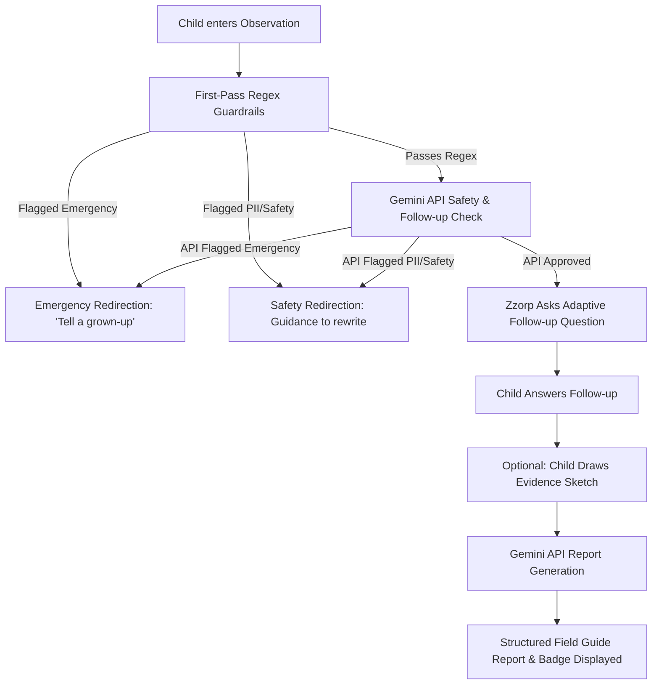

# Zzorp Observation Agent: Capstone Notes

Welcome to the Kaggle Capstone Project demo submission! This document outlines the design, architecture, and safety features of the newly integrated **Zzorp Observation Agent** inside the Earthling Observation Lab.

---

## 👽 Feature Overview

The Zzorp Observation Agent is an interactive, child-friendly tool that transforms simple child observations of human behaviour into a structured "Field Guide Report." It models a lightweight agentic loop that dynamically validates safety, prompts with adaptive follow-up questions, and compiles reports complete with playful interpretations and observation badges.

### 📖 Comic Mission Extension

To deepen the child's understanding of the scientific method and AI literacy, we have extended the agent with a **Comic Mission** mode. Clicking "Create Comic Mission!" takes the child's raw inputs and structures them into a 3-panel comic strip:
1. **Panel 1 — What Zzorp Saw**: Represents the **objective observation** (purely factual and assumption-free).
2. **Panel 2 — Zzorp's Alien Theory**: Represents the **playful interpretation** (a humorous alien misunderstanding or speculation, clearly framed as a possibility rather than absolute fact).
3. **Panel 3 — The Kind Question**: Represents **empathetic questioning** (a constructive next step to learn the truth and practice human communication).

The panel is followed by an interactive game card: **"Can you spot the difference?"** where children are presented with a dynamic single-question quiz asking them to identify either the objective observation (Panel 1), the playful alien theory (Panel 2), or the kind empathy question (Panel 3). The quiz question rotates dynamically based on the report number, reinforcing key curriculum takeaways on distinguishing observed facts from subjective interpretations without feeling repetitive.

---

## 🔄 The Agentic Loop

The interaction follows a structured sequence:



1. **Input Phase**: The child inputs an interesting thing they saw a human do.
2. **First-Pass Guardrail (Local Regex)**: Instantly intercepts serious topics (emergency/harm) or obvious personal information (PII) before hitting any network API.
3. **Mothership Validation (Gemini API)**: Performs deep semantic evaluation to check for sensitive details, violence, mocking, or abuse.
4. **Adaptive Follow-up**: If safe, the agent generates a custom question designed to help the child expand on what they saw, what it meant, or what they wonder.
5. **Report Compilation**: The agent synthesizes the observation and follow-up answer, selecting a playful badge ("Curious Observer", "Junior Anthropologist", or "Kind Question Maker") and writing a structured guide.

---

## 🎓 Connections to Course Themes

### 1. Vibe Coding
* The project leverages large language model prompting to generate dynamic, contextual interactions that would be tedious to program with static rules.
* Instead of rigid scripts, Zzorp acts as a persona, responding dynamically to whatever the child reports.

### 2. Tools & API Integration
* The service integrates with the **Gemini Developer API** via standard REST endpoints utilizing environment variables (`VITE_GEMINI_API_KEY` and `VITE_GEMINI_MODEL`).
* If no key is set or the network is offline, the agent gracefully falls back to a smart local parser (`mockAgent`) that simulates the loop topic-detection questions and reports, ensuring the UI remains robust.

### 3. Context & Agent Skills
* The system utilizes targeted System Instructions to inject Zzorp's persona, language preferences (e.g. British English spelling like *behaviour*), safety filters, and output structures.
* The agent is partitioned into two distinct phases to maintain context: a verification step and a compilation step.

### 4. Safety & Evaluation
* **Multi-tiered Safety**: Employs local regex filters (fast, privacy-preserving) followed by semantic LLM safety checking.
* **Child-Friendly Interventions**:
  * **PII/Privacy**: Gentle redirections guiding children to describe general, non-identifying activities.
  * **Emergency/Harm**: If serious topics are detected, Zzorp stops the loop and outputs: *"This sounds important. Please tell a trusted grown-up."*
* **Motives & Interpretations**: Gemini is instructed to clearly frame interpretations as possibilities (e.g., *"It is possible that..."*, *"They might be..."*) rather than claiming real people's motives as objective facts.

### 5. Deployment Readiness (Frontend vs. Backend)
* **Frontend for Demo**: For the sake of this prototype demo, the API calls are made directly from the client.
* **Production Boundary**: A clear architecture boundary has been established. For a real production release, client-side API keys are insecure. The `verifySafetyAndGetFollowUp` and `generateFieldGuideReport` calls must be moved behind a secure backend server (e.g., Node.js Express, Firebase Cloud Functions, or Google Cloud Run) to encrypt keys and validate children's payloads.

---

## 🛠️ How to Run & Configure

### 1. Run the App Locally
Double-click the `start_zzorp.bat` file in the root folder, or run the following commands in your shell:
```bash
# Start the Vite development server
npm run dev
```
Open [http://localhost:5173](http://localhost:5173) in your web browser.

### 2. Configure Gemini API (Optional)
To run with live Gemini model processing, create a `.env` file in the root directory:
```env
VITE_GEMINI_API_KEY=your_actual_api_key_here
VITE_GEMINI_MODEL=gemini-1.5-flash
```
*If no key is configured, the agent automatically falls back to the smart local parser so the application is fully functional out-of-the-box.*
